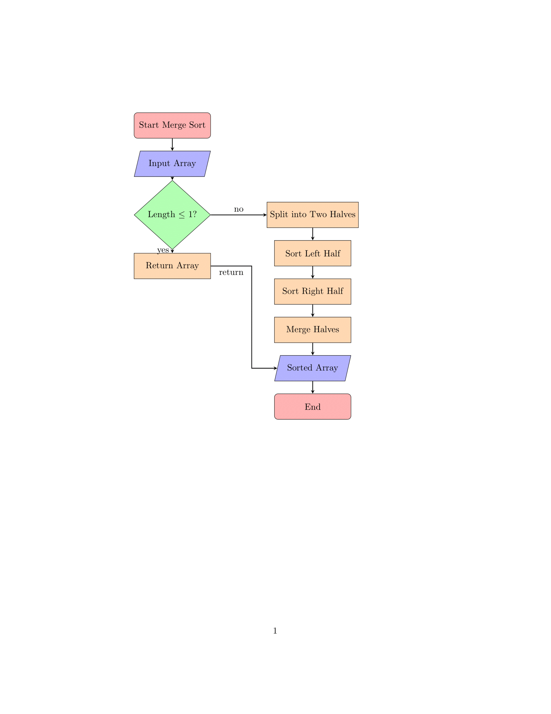
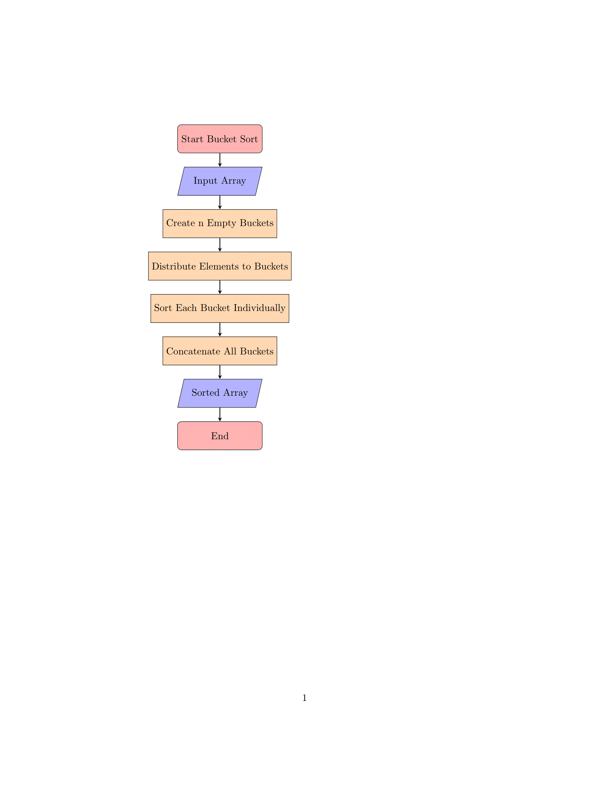

---
jupyter:
  jupytext:
    text_representation:
      extension: .md
      format_name: markdown
      format_version: '1.3'
      jupytext_version: 1.17.3
  kernelspec:
    display_name: Python 3 (ipykernel)
    language: python
    name: python3
---

 # **Алгоритмы сортировки**


## **Цель работы**


изучение основных алгоритмов на сортировки.


Асонов Серей ИУ10-36


## **Задание 1**


### **Классификация алгоритмов сортировки**

#### По принципу работы:
Алгоритмы сравнения: основаны на попарном сравнении элементов

Цифровые алгоритмы: используют внутреннее представление данных

#### По временной сложности:
O(n²) : Пузырьковая, Выбором, Вставками

O(n log n): Слиянием, Быстрая, Пирамидальная

O(n): Блочная, Поразрядная (при определенных условиях)

#### По устойчивости:
Устойчивые: Слиянием, Вставками, Блочная

Неустойчивые: Быстрая, Выбором, Пирамидальная

#### По использованию памяти:
In-place: Быстрая, Пирамидальная, Вставками

Not in-place: Слиянием, Блочная


## **Задание 2**


### **Теоретическое описание алгоритмов**

##### Сортировка слиянием (Merge Sort)
Принцип: Алгоритм стратегии "разделяй и властвуй". Рекурсивно разделяет массив на подмассивы до единичных элементов, затем сливает их в упорядоченные последовательности.

Математическая основа:

Рекуррентное соотношение: T(n) = 2T(n/2) + O(n)

По теореме о рекуррентных соотношениях: T(n) = O(n log n)

#### Блочная сортировка (Bucket Sort)
Принцип: Распределяющий алгоритм, который разбивает входные данные на "ведра" на основе их значений, затем сортирует каждое ведро отдельно.

Условия эффективности:

Равномерное распределение входных данных

Известный диапазон значений

Количество ведер ≈ √n


## **Задание 3**


### **Сортировка слиянием**





```python
### **Сортировка блочная**
```




## **Задание 4**


### **Сортировка слиянием:**


АЛГОРИТМ СортировкаСлиянием(массив A):
    ВХОД: массив A[0..n-1]
    ВЫХОД: отсортированный массив A
    
    ЕСЛИ n <= 1:
        ВОЗВРАТ A  // базовый случай
    
    // Разделение
    середина = n // 2
    левый_подмассив = A[0..середина-1]
    правый_подмассив = A[середина..n-1]
    
    // Рекурсивная сортировка
    отсортированный_левый = СортировкаСлиянием(левый_подмассив)
    отсортированный_правый = СортировкаСлиянием(правый_подмассив)
    
    // Слияние
    ВОЗВРАТ Слияние(отсортированный_левый, отсортированный_правый)

АЛГОРИТМ Слияние(массив L, массив R):
    ВХОД: два отсортированных массива L и R
    ВЫХОД: объединенный отсортированный массив
    
    результат = новый_массив[длина(L) + длина(R)]
    i = 0, j = 0, k = 0
    
    // Сравниваем и добавляем элементы по порядку
    ПОКА i < длина(L) И j < длина(R):
        ЕСЛИ L[i] <= R[j]:
            результат[k] = L[i]
            i = i + 1
        ИНАЧЕ:
            результат[k] = R[j]
            j = j + 1
        k = k + 1
    
    // Добавляем оставшиеся элементы из L
    ПОКА i < длина(L):
        результат[k] = L[i]
        i = i + 1
        k = k + 1
    
    // Добавляем оставшиеся элементы из R
    ПОКА j < длина(R):
        результат[k] = R[j]
        j = j + 1
        k = k + 1
    
    ВОЗВРАТ результат


### **Блочная сортировка:**


АЛГОРИТМ БлочнаяСортировка(массив A, размер_блока):
    ВХОД: массив A[0..n-1], размер блока
    ВЫХОД: отсортированный массив A
    
    ЕСЛИ длина(A) == 0:
        ВОЗВРАТ A
    
    // Находим диапазон значений
    min_значение = минимальный_элемент(A)
    max_значение = максимальный_элемент(A)
    
    // Создаем блоки
    количество_блоков = (max_значение - min_значение) // размер_блока + 1
    блоки = новый_массив[количество_блоков] из пустых списков
    
    // Распределяем элементы по блокам
    ДЛЯ КАЖДОГО элемента В A:
        индекс_блока = (элемент - min_значение) // размер_блока
        добавить элемент в блоки[индекс_блока]
    
    // Сортируем каждый блок и объединяем
    результат = пустой_массив
    ДЛЯ КАЖДОГО блока В блоки:
        отсортированный_блок = СортировкаВставками(блок)
        добавить отсортированный_блок в результат
    
    ВОЗВРАТ результат

АЛГОРИТМ СортировкаВставками(массив A):
    ВХОД: массив A[0..n-1]
    ВЫХОД: отсортированный массив A
    
    ДЛЯ i ОТ 1 ДО длина(A) - 1:
        ключ = A[i]
        j = i - 1
        
        // Сдвигаем элементы большие ключа
        ПОКА j >= 0 И A[j] > ключ:
            A[j + 1] = A[j]
            j = j - 1
        
        A[j + 1] = ключ
    
    ВОЗВРАТ A


## **Задание 5**


### **Сортировка слиянием:**
#### Достоинства:

Гарантированная временная сложность O(n log n) для любых случаев

Устойчивость - сохраняет порядок равных элементов

Предсказуемое поведение независимо от входных данных

Эффективна для больших объемов данных

Хорошо параллелизуется

#### Недостатки:

Требует O(n) дополнительной памяти

Медленнее in-place алгоритмов на небольших массивах

Рекурсивные вызовы могут вызывать переполнение стека

Константа в O-нотации больше, чем у быстрой сортировки

### **Блочная сортировка:**

#### Достоинства:

Линейная сложность O(n) в среднем случае

Эффективна при равномерном распределении данных

Устойчивость (при правильной реализации)

Хорошо работает с данными с известным диапазоном

#### Недостатки:

Вырождается до O(n²) при плохом распределении

Требует знания о распределении входных данных

Неэффективна для данных с выбросами

Требует дополнительной памяти O(n + k)

Сложность зависит от алгоритма сортировки блоков


## **Задания 6 - 11**

```python
import time
import random
import matplotlib.pyplot as plt
import math

# 1. Сортировка слиянием (Merge Sort)
def merge_sort(arr):
    if len(arr) <= 1:
        return arr
    
    mid = len(arr) // 2
    left = merge_sort(arr[:mid])
    right = merge_sort(arr[mid:])
    
    return merge(left, right)

def merge(left, right):
    result = []
    i = j = 0
    
    while i < len(left) and j < len(right):
        if left[i] <= right[j]:
            result.append(left[i])
            i += 1
        else:
            result.append(right[j])
            j += 1
    
    result.extend(left[i:])
    result.extend(right[j:])
    return result

# 2. Блочная сортировка (Bucket Sort)
def bucket_sort(arr, bucket_size=5):
    if len(arr) == 0:
        return arr
    
    # Находим минимальное и максимальное значения
    min_val = min(arr)
    max_val = max(arr)
    
    # Создаем блоки
    bucket_count = (max_val - min_val) // bucket_size + 1
    buckets = [[] for _ in range(bucket_count)]
    
    # Распределяем элементы по блокам
    for num in arr:
        bucket_index = (num - min_val) // bucket_size
        buckets[bucket_index].append(num)
    
    # Сортируем каждый блок и объединяем
    result = []
    for bucket in buckets:
        # Используем сортировку вставками для сортировки блоков
        result.extend(insertion_sort(bucket))
    
    return result

def insertion_sort(arr):
    for i in range(1, len(arr)):
        key = arr[i]
        j = i - 1
        while j >= 0 and arr[j] > key:
            arr[j + 1] = arr[j]
            j -= 1
        arr[j + 1] = key
    return arr

# Функция для измерения времени выполнения
def measure_sorting_time(sort_func, arr, *args):
    arr_copy = arr.copy()
    start_time = time.time()
    sort_func(arr_copy, *args)
    end_time = time.time()
    return end_time - start_time

# Генерация тестовых данных
def generate_test_arrays(n, array_type):
    if array_type == 'sorted':
        return list(range(n))
    elif array_type == 'reverse_sorted':
        return list(range(n, 0, -1))
    elif array_type == 'random':
        return [random.randint(1, 100000) for _ in range(n)]
    return None

# Основная функция тестирования
def test_sorting_algorithms():
    sizes = [1000, 5000, 10000, 100000]  # n1, n2, n3, n4
    array_types = ['sorted', 'reverse_sorted', 'random']
    algorithms = {
        'Сортировка слиянием': (merge_sort, []),
        'Блочная сортировка': (bucket_sort, [10])  # bucket_size = 10
    }
    
    results = {algo: {arr_type: [] for arr_type in array_types} for algo in algorithms}
    
    for size in sizes:
        print(f"\n--- Тестирование для n = {size} ---")
        
        for arr_type in array_types:
            test_array = generate_test_arrays(size, arr_type)
            print(f"\nТип массива: {arr_type}")
            
            for algo_name, (algo_func, args) in algorithms.items():
                time_taken = measure_sorting_time(algo_func, test_array, *args)
                results[algo_name][arr_type].append(time_taken)
                print(f"{algo_name}: {time_taken:.4f} секунд")
    
    return results, sizes

# Визуализация результатов
def plot_results(results, sizes):
    array_types = ['sorted', 'reverse_sorted', 'random']
    algorithms = list(results.keys())
    
    fig, axes = plt.subplots(1, 3, figsize=(18, 6))
    
    for i, arr_type in enumerate(array_types):
        for algo_name in algorithms:
            times = results[algo_name][arr_type]
            axes[i].plot(sizes, times, marker='o', label=algo_name)
        
        axes[i].set_title(f'Тип массива: {arr_type}')
        axes[i].set_xlabel('Размер массива')
        axes[i].set_ylabel('Время (секунды)')
        axes[i].legend()
        axes[i].grid(True)
    
    plt.tight_layout()
    plt.savefig('sorting_comparison.png')
    plt.show()

# Ручная трассировка для небольших массивов
def manual_trace():
    print("=== РУЧНАЯ ТРАССИРОВКА ===")
    
    # Тестовый массив
    test_array = [64, 34, 25, 12, 22, 11, 90, 5]
    print(f"Исходный массив: {test_array}")
    
    # Сортировка слиянием
    print("\n--- Сортировка слиянием ---")
    sorted_merge = merge_sort(test_array.copy())
    print(f"Результат: {sorted_merge}")
    
    # Блочная сортировка
    print("\n--- Блочная сортировка ---")
    sorted_bucket = bucket_sort(test_array.copy(), 20)
    print(f"Результат: {sorted_bucket}")

# Анализ эффективности
def analyze_efficiency(results, sizes):
    print("\n=== АНАЛИЗ ЭФФЕКТИВНОСТИ ===")
    for size in sizes:
        print(f"\nДля n = {size}:")
        for arr_type in ['sorted', 'reverse_sorted', 'random']:
            merge_time = results['Сортировка слиянием'][arr_type][sizes.index(size)]
            bucket_time = results['Блочная сортировка'][arr_type][sizes.index(size)]
            
            faster = "Слиянием" if merge_time < bucket_time else "Блочная"
            difference = abs(merge_time - bucket_time)
            
            print(f"  {arr_type}: {faster} быстрее на {difference:.4f} сек")

# Запуск тестирования
if __name__ == "__main__":
    # Ручная трассировка
    manual_trace()
    
    # Основное тестирование
    print("\n=== ОСНОВНОЕ ТЕСТИРОВАНИЕ ===")
    results, sizes = test_sorting_algorithms()
    
    # Визуализация результатов
    plot_results(results, sizes)
    
    # Анализ эффективности
    analyze_efficiency(results, sizes)
```


## **Ручная трассировка алгоритмов**


### Сортировка слиянием для массива [64, 34, 25, 12, 22, 11, 90, 5]:

<!-- #raw -->
Разделение:
[64, 34, 25, 12] и [22, 11, 90, 5]
[64, 34] и [25, 12] | [22, 11] и [90, 5]
[64] [34] [25] [12] [22] [11] [90] [5]

Слияние:
[34, 64] + [12, 25] → [12, 25, 34, 64]
[11, 22] + [5, 90] → [5, 11, 22, 90]
[12, 25, 34, 64] + [5, 11, 22, 90] → [5, 11, 12, 22, 25, 34, 64, 90]
<!-- #endraw -->

### Блочная сортировка для массива [64, 34, 25, 12, 22, 11, 90, 5] (bucket_size=20):


Диапазон значений: min=5, max=90
Количество блоков: (90-5)//20 + 1 = 5 блоков

Распределение по блокам:
Блок 0 [5-24]: [12, 22, 11, 5]
Блок 1 [25-44]: [34, 25]
Блок 2 [45-64]: [64]
Блок 3 [65-84]: []
Блок 4 [85-104]: [90]

Сортировка блоков:
Блок 0: [5, 11, 12, 22]
Блок 1: [25, 34]
Блок 2: [64]
Блок 3: []
Блок 4: [90]

Объединение: [5, 11, 12, 22, 25, 34, 64, 90]


## **Анализ эффективности**

<!-- #region -->
### **Критерии сравнения:**
#### 1.Временная сложность:
##### Сортировка слиянием (Merge Sort):


Лучший случай:   O(n log n)
Средний случай:  O(n log n) 
Худший случай:   O(n log n)
Обоснование:

Алгоритм всегда делит массив пополам: log n уровней рекурсии

На каждом уровне выполняется слияние за O(n)

Итого: O(n) × O(log n) = O(n log n)

##### Блочная сортировка (Bucket Sort):

Лучший случай:   O(n + k)
Средний случай:  O(n + k)
Худший случай:   O(n²)
Обоснование:

Лучший случай: равномерное распределение, все блоки содержат ≈ n/k элементов

Худший случай: все элементы попадают в один блок → вырождается в O(n²)

k - количество блоков

#### 2.Память:

##### Сортировка слиянием:

Требуемая память: O(n)
Распределение памяти:

Дополнительный массив для слияния: O(n)

Стек вызовов рекурсии: O(log n)

Итого: O(n)

##### Блочная сортировка:

Требуемая память: O(n + k)
Распределение памяти:

Массив блоков: O(k)

Элементы в блоках: O(n)

Итого: O(n + k)

#### 3.Устойчивость:

##### Сортировка слиянием:устойчивая

Сохраняет относительный порядок равных элементов

Элементы из левого подмассива добавляются первыми

##### Блочная сортировка : ЗАВИСИТ от алгоритма сортировки блоков
Варианты:

Устойчивая: если использовать устойчивую сортировку блоков (сортировку вставками)

Неустойчивая: если использовать неустойчивую сортировку блоков
<!-- #endregion -->

<!-- #region -->
## Контрольные вопросы:
Сортировка вставками (Insertion Sort)
1. В чем состоит суть метода сортировки вставками?
Суть метода заключается в том, что массив постепенно перестраивается путем последовательной вставки каждого следующего элемента в уже упорядоченную часть массива. Мы как бы "вставляем" карту в нужное место в уже отсортированной руке.


def insertion_sort(arr):
    for i in range(1, len(arr)):
        key = arr[i]
        j = i - 1
        # Сдвигаем элементы отсортированной части, которые больше key
        while j >= 0 and arr[j] > key:
            arr[j + 1] = arr[j]
            j -= 1
        # Вставляем key на правильную позицию
        arr[j + 1] = key
    return arr


4. В чем достоинства и недостатки метода сортировки вставками?

Достоинства:

Прост в реализации.

Эффективен на небольших наборах данных.

Эффективен на практически отсортированных массивах (сложность接近 O(n)).

Является устойчивой (stable) сортировкой.

Сортирует "на месте" (in-place), не требует дополнительной памяти.

Недостатки:

Имеет высокую среднюю временную сложность O(n²), что делает его неэффективным для больших массивов.

5. Приведите практический пример сортировки массива методом вставок.
Массив: [12, 11, 13, 5, 6]

i=1: [11, 12, 13, 5, 6] (11 вставлен перед 12)

i=2: [11, 12, 13, 5, 6] (13 остался на месте)

i=3: [5, 11, 12, 13, 6] (5 вставлен в начало)

i=4: [5, 6, 11, 12, 13] (6 вставлен между 5 и 11)


Сортировка Шелла (Shell Sort)
6. В чем состоит суть сортировки методом Шелла?
Это усовершенствование сортировки вставками. Суть в том, что массив сортируется в несколько этапов с использованием убывающей последовательности шагов (gaps). На каждом этапе сортируются подмассивы элементов, отстоящих друг от друга на расстоянии gap.

7. За счет чего метод Шелла дает лучшие показатели по сравнению с простейшими методами?
За счет того, что на начальных этапах (с большим gap) элементы "перепрыгивают" на значительные расстояния, что позволяет быстрее занять свою приблизительную позицию.

9. Какой фактор оказывает наибольшее влияние на эффективность сортировки методом Шелла?
Наибольшее влияние оказывает выбор последовательности шагов (gaps). Разные последовательности дают разную теоретическую и практическую производительность.

10. Какие последовательности шагов группировки рекомендуются для практического использования в методе Шелла?

Последовательность Кнута: (3^k - 1) / 2 (1, 4, 13, 40, 121, ...). Хороший баланс между простотой и эффективностью.

Последовательность Седжвика: 9 * (4^(k-1) - 2^(k-1)) + 1 и 4^k - 3 * 2^k + 1 (1, 8, 23, 77, 281, ...). Одна из лучших известных последовательностей.

Последовательность Хиббарда: 2^k - 1 (1, 3, 7, 15, 31, ...).

def shell_sort(arr):
    n = len(arr)
    # Начинаем с большого gap, затем уменьшаем его
    gap = n // 2
    while gap > 0:
        # Применяем сортировку вставками для этого gap
        for i in range(gap, n):
            temp = arr[i]
            j = i
            while j >= gap and arr[j - gap] > temp:
                arr[j] = arr[j - gap]
                j -= gap
            arr[j] = temp
        gap //= 2  # Уменьшаем gap
    return arr

Сортировка выбором (Selection Sort)
12. В чем состоит суть метода сортировки выбором?
Суть в том, что массив мысленно делится на две части: отсортированную (в начале) и неотсортированную. На каждом шаге алгоритм ищет минимальный элемент в неотсортированной части и меняет его местами с первым элементом неотсортированной части. Таким образом, размер отсортированной части увеличивается на один элемент.

def selection_sort(arr):
    for i in range(len(arr)):
        min_idx = i
        # Находим индекс минимального элемента в неотсортированной части
        for j in range(i + 1, len(arr)):
            if arr[j] < arr[min_idx]:
                min_idx = j
        # Меняем найденный минимальный элемент с первым неотсортированным
        arr[i], arr[min_idx] = arr[min_idx], arr[i]
    return arr


15. В чем достоинства и недостатки метода сортировки выбором?

Достоинства:

Прост в понимании и реализации.

Производит минимальное количество обменов (всего O(n)). Полезно, когда стоимость операции обмена высока (например, сортировка данных на внешних носителях).

Сортирует "на месте".

Недостатки:

Всегда имеет временную сложность O(n²), независимо от исходного состояния массива.

Не является устойчивой (unstable) сортировкой.   


Сортировка обменом (Пузырьковая сортировка - Bubble Sort)
17. В чем состоит суть метода сортировки обменом?
Суть в последовательном сравнении соседних элементов и их обмене, если они находятся в неправильном порядке. В результате каждого полного прохода по массиву самый "тяжелый" (максимальный) элемент "всплывает" в конец массива, как пузырёк.


def bubble_sort(arr):
    n = len(arr)
    for i in range(n):
        swapped = False  # Флаг оптимизации
        # Последние i элементов уже на месте
        for j in range(0, n - i - 1):
            if arr[j] > arr[j + 1]:
                arr[j], arr[j + 1] = arr[j + 1], arr[j]
                swapped = True
        # Если обменов не было, массив отсортирован
        if not swapped:
            break
    return arr


20. В чем достоинства и недостатки метода сортировки обменом?

Достоинства:

Чрезвычайно прост для понимания.

Является устойчивой сортировкой.

Сортирует "на месте".

Недостатки:

Очень медленный. Имеет среднюю и наихудшую временную сложность O(n²).

На практике почти всегда уступает другим алгоритмам, кроме, возможно, сортировки вставками на очень маленьких или почти отсортированных массивах.


Быстрая сортировка (Quicksort)
22. В чем состоит суть метода быстрой сортировки?
Это алгоритм типа "разделяй и властвуй". Он выбирает опорный элемент (pivot), переупорядочивает массив так, чтобы все элементы меньше опорного оказались слева от него, а все больше — справа (этот процесс называется разбиение Хоара). Затем алгоритм рекурсивно применяется к двум подмассивам слева и справа от опорного элемента.

23. За счет чего метод быстрой сортировки дает лучшие показатели по сравнению с простейшими методами?
За счет того, что после разбиения элементы оказываются в правильной позиции относительно опорного, и дальнейшая сортировка подмассивов происходит независимо. В среднем случае это дает временную сложность O(n log n). На практике он очень эффективен из-за малого количества обменов и внутреннего цикла.

24. Что такое опорный элемент в методе быстрой сортировки и как он используется?
Опорный элемент (pivot) — это элемент массива, относительно которого происходит разделение. После разбиения он занимает свою окончательную позию в отсортированном массиве. Алгоритм гарантирует, что все элементы слева <= pivot, а справа >= pivot.

25. Приведите практический пример быстрой сортировки массива.
Массив: [10, 80, 30, 90, 40, 50, 70]. Опорный элемент (pivot) — последний (70).

Разбиение:

i указывает на границу элементов, меньших опорного.

Проходим j по массиву. Если arr[j] <= pivot, меняем arr[i] и arr[j], увеличиваем i.

В конце меняем arr[i] и pivot.

Результат разбиения: [10, 30, 40, 50, 70, 90, 80]. Pivot (70) на своем месте.

Рекурсивно применяем к подмассивам [10, 30, 40, 50] и [90, 80].

26. Что можно сказать о применимости метода быстрой сортировки с точки зрения его эффективности?
Это один из самых эффективных и широко применяемых алгоритмов сортировки общего назначения. Он особенно хорошо работает со случайными данными и в среднем случае. Однако он может быть нестабильным и имеет плохую производительность в худшем случае O(n²).

27. Какой фактор оказывает решающее влияние на эффективность метода быстрой сортировки?
Выбор опорного элемента. Если опорный элемент постоянно оказывается минимальным или максимальным (например, в уже отсортированном массиве при выборе первого/последнего элемента), разбиение будет крайне несбалансированным, что приводит к худшему случаю O(n²).

28. Почему выбор серединного элемента в качестве опорного в методе быстрой сортировки может резко ухудшать эффективность метода?
Вопрос сформулирован неточно. Выбор серединного элемента как раз является хорошей стратегией для избежания худшего случая на уже отсортированных массивах. Ухудшение эффективности наступает при выборе крайних элементов (первого или последнего) в уже отсортированном или почти отсортированном массиве.

29. Какое правило выбора опорного элемента в методе быстрой сортировки является наилучшим и почему его сложно использовать?
Наилучшим является медиана трех (медиана из первого, среднего и последнего элементов). Она почти гарантирует сбалансированное разбиение. Однако ее сложно использовать, потому что точное вычисление медианы для всего массива слишком дорогое, а "медиана трех" является хорошим и быстрым приближением.

30. Какое простое правило выбора опорного элемента в методе быстрой сортировки рекомендуется использовать на практике?
Рекомендуется использовать "медиану трех" (первый, средний, последний элементы) или случайный выбор опорного элемента. Оба этих подхода с высокой вероятностью предотвращают наступление худшего случая.


31. Какие усовершенствования имеет базовый алгоритм метода быстрой сортировки?

Использование "медианы трех" для выбора опорного элемента.

Рекурсивная сортировка меньшего подмассива первым для ограничения глубины рекурсии.

Использование сортировки вставками для маленьких подмассивов (например, размером < 10).

Нерекурсивная (итеративная) реализация с использованием стека.

32. Почему быстрая сортировка проще всего программно реализуется с помощью рекурсии?
Потому что алгоритм по своей природе рекурсивен: после разбиения задача сводится к решению двух независимых и аналогичных подзадач (сортировка левого и правого подмассивов). Рекурсия интуитивно отражает эту логику "разделяй и властвуй".

33. Как программно реализуется рекурсивный вариант метода быстрой сортировки?


def quicksort(arr):
    if len(arr) <= 1:
        return arr
    else:
        # Выбор опорного элемента (здесь - последний)
        pivot = arr[-1]
        # Разбиение Хоара
        less = [x for x in arr[:-1] if x <= pivot]
        greater = [x for x in arr[:-1] if x > pivot]
        # Рекурсивный вызов и объединение
        return quicksort(less) + [pivot] + quicksort(greater)

Более эффективная in-place версия:
def quicksort_in_place(arr, low=0, high=None):
    if high is None:
        high = len(arr) - 1
    if low < high:
        # pi - индекс разбиения, arr[pi] на своем месте
        pi = partition(arr, low, high)
        quicksort_in_place(arr, low, pi - 1)
        quicksort_in_place(arr, pi + 1, high)

def partition(arr, low, high):
    pivot = arr[high]
    i = low - 1
    for j in range(low, high):
        if arr[j] <= pivot:
            i += 1
            arr[i], arr[j] = arr[j], arr[i]
    arr[i + 1], arr[high] = arr[high], arr[i + 1]
    return i + 1

    
34. Какие особенности имеет не рекурсивная программная реализация метода быстрой сортировки?
Она эмулирует рекурсию с помощью стека. В стек помещаются границы подмассивов (low и high), которые нужно отсортировать. Алгоритм продолжается, пока стек не пуст.

Особенности:

Требует явного управления стеком.

Позволяет избежать ограничений на глубину рекурсии.

Может быть более эффективной по памяти, если сначала помещать в стек больший подмассив.


Пирамидальная сортировка (Heapsort)
35. В чем состоит суть метода пирамидальной сортировки?
Суть в использовании структуры данных "куча" (пирамида - heap). Алгоритм состоит из двух этапов:

Построение из массива невозрастающей пирамиды (max-heap), где корень каждого поддерева является наибольшим элементом.

Последовательное извлечение максимального элемента из кучи и перестроение оставшейся части.

36. Какой набор данных имеет пирамидальную организацию?
Пирамидальную организацию имеет двоичная куча (binary heap). Это полное бинарное дерево, которое удовлетворяет свойству кучи: ключ каждого узла >= (для max-heap) ключей его потомков.


38. Приведите пример пирамидального дерева с целочисленными ключами.
Массив: [4, 10, 3, 5, 1]. Max-Heap в виде дерева:


      10
     /  \
    5    3
   / \
  4   1
Соответствующий массив для кучи: [10, 5, 3, 4, 1].

39. Какие полезные свойства имеет пирамидальное дерево?

Максимальный (или минимальный) элемент всегда находится в корне.

Можно эффективно вставлять новые элементы и извлекать корневой, сохраняя свойства кучи (за O(log n)).

Представление в виде массива очень компактно и не требует хранения указателей.

40. Какие шаги выполняются при построении пирамидального дерева?
Построение снизу вверх (алгоритм Флойда).

Начинаем с последнего нелистового узла (индекс n//2 - 1).

Для каждого такого узла выполняем операцию просеивания вниз (sift down), чтобы восстановить свойство кучи для поддерева с корнем в этом узле.

Переходим к предыдущему узлу (уменьшаем индекс) и повторяем шаг 2, пока не дойдем до корня.

41. Что такое просеивание элемента через пирамиду?
Просеивание вниз (sift down) — это процесс восстановления свойства кучи для узла i. Если узел i меньше какого-либо из своих потомков, он меняется местами с наибольшим из потомков. Процесс повторяется рекурсивно для поддерева, в которое "упал" узел, пока свойство кучи не будет восстановлено.

42. Приведите практический пример построения пирамидального дерева.
Массив: [4, 10, 3, 5, 1].

Начинаем с последнего нелистового узла (индекс = 1, элемент 10). Его поддерево уже является кучей.

Переходим к корню (индекс = 0, элемент 4).

Просеиваем 4 вниз: сравниваем с потомками (10 и 3). 10 - наибольший. Меняем 4 и 10.

Новый массив: [10, 4, 3, 5, 1].

Просеиваем 4 (теперь на индексе 1): сравниваем с потомками (5 и 1). 5 - наибольший. Меняем 4 и 5.

Итоговый массив (max-heap): [10, 5, 3, 4, 1].

43. Какие шаги выполняются на втором этапе пирамидальной сортировки?

Поменять местами корневой (максимальный) элемент кучи с последним элементом неотсортированной части.

Уменьшить размер кучи (мысленно отрезать последний элемент, который теперь на своем месте).

Выполнить sift down для нового корня, чтобы восстановить свойства кучи в уменьшенной куче.

Повторять шаги 1-3, пока размер кучи не станет равен 1.

44. Приведите практический пример реализации второго этапа пирамидальной сортировки.
Начальная куча (и массив): [10, 5, 3, 4, 1]

Шаг 1: Меняем 10 и 1. Массив: [1, 5, 3, 4, | 10]. Просеиваем 1.

[5, 1, 3, 4, | 10] -> [5, 4, 3, 1, | 10].

Шаг 2: Меняем 5 и 1. Массив: [1, 4, 3, | 5, 10]. Просеиваем 1.

[4, 1, 3, | 5, 10].

Шаг 3: Меняем 4 и 3. Массив: [3, 1, | 4, 5, 10]. Просеиваем 3.

[3, 1, | 4, 5, 10] (не изменилось).

Шаг 4: Меняем 3 и 1. Массив: [1, | 3, 4, 5, 10]. Сортировка завершена.

45. Что можно сказать о трудоемкости метода пирамидальной сортировки?

Временная сложность: Всегда O(n log n), как в среднем, так и в худшем случае.

Сложность по памяти: O(1), так как сортировка происходит "на месте".

Это делает пирамидальную сортировку надежной и предсказуемой, хотя на практике она часто немного медленнее, чем хорошо оптимизированная быстрая сортировка, из-за большего количества сравнений и худшей локализации ссылок (cache performance).


<!-- #endregion -->

```python

```
