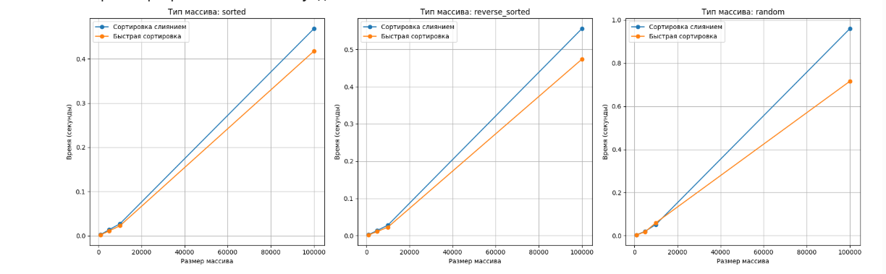

---
jupyter:
  jupytext:
    text_representation:
      extension: .md
      format_name: markdown
      format_version: '1.3'
      jupytext_version: 1.17.3
  kernelspec:
    display_name: Python 3 (ipykernel)
    language: python
    name: python3
---

 # **Алгоритмы сортировки**


## **Цель работы**


изучение основных алгоритмов на сортировки.


Асонов Серей ИУ10-36


## **Задание 1**


### **Классификация алгоритмов сортировки**

#### По принципу работы:
Алгоритмы сравнения: основаны на попарном сравнении элементов

Цифровые алгоритмы: используют внутреннее представление данных

#### По временной сложности:
O(n²) : Пузырьковая, Выбором, Вставками

O(n log n): Слиянием, Быстрая, Пирамидальная

O(n): Блочная, Поразрядная (при определенных условиях)

#### По устойчивости:
Устойчивые: Слиянием, Вставками, Блочная

Неустойчивые: Быстрая, Выбором, Пирамидальная

#### По использованию памяти:
In-place: Быстрая, Пирамидальная, Вставками

Not in-place: Слиянием, Блочная


## **Задание 2**


### **Теоретическое описание алгоритмов**

##### Сортировка слиянием (Merge Sort)
Принцип: Алгоритм стратегии "разделяй и властвуй". Рекурсивно разделяет массив на подмассивы до единичных элементов, затем сливает их в упорядоченные последовательности.

Математическая основа:

Рекуррентное соотношение: T(n) = 2T(n/2) + O(n)

По теореме о рекуррентных соотношениях: T(n) = O(n log n)

#### Блочная сортировка (Bucket Sort)
Принцип: Распределяющий алгоритм, который разбивает входные данные на "ведра" на основе их значений, затем сортирует каждое ведро отдельно.

Условия эффективности:

Равномерное распределение входных данных

Известный диапазон значений

Количество ведер ≈ √n


## **Задание 3**


### **Сортировка слиянием**


### **Блочная сортировка**


## **Задание 4**


### **Сортировка слиянием:**


function MERGE_SORT(A[0..n-1]):
    if n ≤ 1:
        return A
    
    mid = n // 2
    left = A[0..mid-1]
    right = A[mid..n-1]
    
    left_sorted = MERGE_SORT(left)
    right_sorted = MERGE_SORT(right)
    
    return MERGE(left_sorted, right_sorted)

function MERGE(left[0..p-1], right[0..q-1]):
    result = new array[0..p+q-1]
    i = 0, j = 0, k = 0
    
    while i < p and j < q:
        if left[i] ≤ right[j]:
            result[k] = left[i]
            i = i + 1
        else:
            result[k] = right[j]
            j = j + 1
        k = k + 1
    
    while i < p:
        result[k] = left[i]
        i = i + 1
        k = k + 1
        
    while j < q:
        result[k] = right[j]
        j = j + 1
        k = k + 1
    
    return result


### **Блочная сортировка:**


function BUCKET_SORT(A[0..n-1]):
    if n == 0:
        return A
    
    // Находим диапазон значений
    min_val = MIN(A)
    max_val = MAX(A)
    
    if min_val == max_val:
        return A
    
    // Создаем n блоков
    buckets = new array of n empty lists
    
    // Распределяем элементы по блокам
    for i = 0 to n-1:
        normalized = (A[i] - min_val) / (max_val - min_val)
        bucket_index = floor(normalized * (n - 1))
        APPEND(buckets[bucket_index], A[i])
    
    // Сортируем каждый блок
    for i = 0 to n-1:
        if LENGTH(buckets[i]) > 0:
            INSERTION_SORT(buckets[i])
    
    // Объединяем блоки
    k = 0
    for i = 0 to n-1:
        for j = 0 to LENGTH(buckets[i]) - 1:
            A[k] = buckets[i][j]
            k = k + 1
    
    return A

function INSERTION_SORT(A[0..n-1]):
    for i = 1 to n-1:
        key = A[i]
        j = i - 1
        while j ≥ 0 and A[j] > key:
            A[j+1] = A[j]
            j = j - 1
        A[j+1] = key


## **Задание 5**


### **Сортировка слиянием:**
#### Достоинства:

Гарантированная временная сложность O(n log n) для любых случаев

Устойчивость - сохраняет порядок равных элементов

Предсказуемое поведение независимо от входных данных

Эффективна для больших объемов данных

Хорошо параллелизуется

#### Недостатки:

Требует O(n) дополнительной памяти

Медленнее in-place алгоритмов на небольших массивах

Рекурсивные вызовы могут вызывать переполнение стека

Константа в O-нотации больше, чем у быстрой сортировки

### **Блочная сортировка:**

#### Достоинства:

Линейная сложность O(n) в среднем случае

Эффективна при равномерном распределении данных

Устойчивость (при правильной реализации)

Хорошо работает с данными с известным диапазоном

#### Недостатки:

Вырождается до O(n²) при плохом распределении

Требует знания о распределении входных данных

Неэффективна для данных с выбросами

Требует дополнительной памяти O(n + k)

Сложность зависит от алгоритма сортировки блоков


## **Задания 6 - 11**

```python
import time
import random
import matplotlib.pyplot as plt
import copy

# Сортировка слиянием (Merge Sort)
def merge_sort(arr):
    if len(arr) <= 1:
        return arr
    
    mid = len(arr) // 2
    left = merge_sort(arr[:mid])
    right = merge_sort(arr[mid:])
    
    return merge(left, right)

def merge(left, right):
    result = []
    i = j = 0
    
    while i < len(left) and j < len(right):
        if left[i] <= right[j]:
            result.append(left[i])
            i += 1
        else:
            result.append(right[j])
            j += 1
    
    result.extend(left[i:])
    result.extend(right[j:])
    return result

# Быстрая сортировка (Quick Sort)
def quick_sort(arr):
    if len(arr) <= 1:
        return arr
    
    pivot = arr[len(arr) // 2]
    left = [x for x in arr if x < pivot]
    middle = [x for x in arr if x == pivot]
    right = [x for x in arr if x > pivot]
    
    return quick_sort(left) + middle + quick_sort(right)

# Функция для измерения времени выполнения
def measure_sorting_time(sort_func, arr):
    start_time = time.time()
    sort_func(arr.copy())
    end_time = time.time()
    return end_time - start_time

# Генерация тестовых данных
def generate_test_arrays(n, array_type):
    if array_type == 'sorted':
        return list(range(n))
    elif array_type == 'reverse_sorted':
        return list(range(n, 0, -1))
    elif array_type == 'random':
        return [random.randint(1, 100000) for _ in range(n)]
    return None

# Основная функция тестирования
def test_sorting_algorithms():
    sizes = [1000, 5000, 10000, 100000]  # n1, n2, n3, n4
    array_types = ['sorted', 'reverse_sorted', 'random']
    algorithms = {
        'Сортировка слиянием': merge_sort,
        'Быстрая сортировка': quick_sort
    }
    
    results = {algo: {arr_type: [] for arr_type in array_types} for algo in algorithms}
    
    for size in sizes:
        print(f"\n--- Тестирование для n = {size} ---")
        
        for arr_type in array_types:
            test_array = generate_test_arrays(size, arr_type)
            print(f"\nТип массива: {arr_type}")
            
            for algo_name, algo_func in algorithms.items():
                time_taken = measure_sorting_time(algo_func, test_array)
                results[algo_name][arr_type].append(time_taken)
                print(f"{algo_name}: {time_taken:.4f} секунд")
    
    return results, sizes

# Визуализация результатов
def plot_results(results, sizes):
    array_types = ['sorted', 'reverse_sorted', 'random']
    algorithms = list(results.keys())
    
    fig, axes = plt.subplots(1, 3, figsize=(18, 6))
    
    for i, arr_type in enumerate(array_types):
        for algo_name in algorithms:
            times = results[algo_name][arr_type]
            axes[i].plot(sizes, times, marker='o', label=algo_name)
        
        axes[i].set_title(f'Тип массива: {arr_type}')
        axes[i].set_xlabel('Размер массива')
        axes[i].set_ylabel('Время (секунды)')
        axes[i].legend()
        axes[i].grid(True)
    
    plt.tight_layout()
    plt.show()

# Ручная трассировка для небольших массивов
def manual_trace():
    print("=== РУЧНАЯ ТРАССИРОВКА ===")
    
    # Тестовый массив
    test_array = [64, 34, 25, 12, 22, 11, 90]
    print(f"Исходный массив: {test_array}")
    
    # Сортировка слиянием
    sorted_merge = merge_sort(test_array.copy())
    print(f"Сортировка слиянием: {sorted_merge}")
    
    # Быстрая сортировка
    sorted_quick = quick_sort(test_array.copy())
    print(f"Быстрая сортировка: {sorted_quick}")

# Запуск тестирования
if __name__ == "__main__":
    # Ручная трассировка
    manual_trace()
    
    # Основное тестирование
    print("\n=== ОСНОВНОЕ ТЕСТИРОВАНИЕ ===")
    results, sizes = test_sorting_algorithms()
    
    # Визуализация результатов
    plot_results(results, sizes)
    
    # Анализ эффективности
    print("\n=== АНАЛИЗ ЭФФЕКТИВНОСТИ ===")
    for size in sizes:
        print(f"\nДля n = {size}:")
        for arr_type in ['sorted', 'reverse_sorted', 'random']:
            merge_time = results['Сортировка слиянием'][arr_type][sizes.index(size)]
            quick_time = results['Быстрая сортировка'][arr_type][sizes.index(size)]
            
            faster = "Слиянием" if merge_time < quick_time else "Быстрая"
            difference = abs(merge_time - quick_time)
            
            print(f"  {arr_type}: {faster} быстрее на {difference:.4f} сек")
```




## **Ручная трассировка алгоритмов**


### Сортировка слиянием для массива [64, 34, 25, 12, 22, 11, 90]:

<!-- #raw -->
Разделение:
[64, 34, 25] и [12, 22, 11, 90]
[64] [34, 25] и [12, 22] [11, 90]
[64] [34] [25] и [12] [22] [11] [90]

Слияние:
[34, 64] + [25] → [25, 34, 64]
[12, 22] + [11, 90] → [11, 12, 22, 90]
[25, 34, 64] + [11, 12, 22, 90] → [11, 12, 22, 25, 34, 64, 90]
<!-- #endraw -->

### Быстрая сортировка для массива [64, 34, 25, 12, 22, 11, 90]:


Опорный элемент: 12
Меньшие: [] | Равные: [12] | Большие: [64, 34, 25, 22, 11, 90]

Рекурсия для больших:
Опорный: 25
Меньшие: [22, 11] | Равные: [25] | Большие: [64, 34, 90]

И т.д. до полной сортировки


## **Анализ эффективности**


### **Критерии сравнения:**
#### 1.Временная сложность:

Сортировка слиянием: O(n log n) в худшем, среднем и лучшем случаях

Быстрая сортировка: O(n log n) в среднем, O(n²) в худшем случае

#### 2.Память:

Сортировка слиянием: O(n) дополнительной памяти

Быстрая сортировка: O(log n) дополнительной памяти в среднем случае

#### 3.Устойчивость:

Сортировка слиянием: устойчивая

Быстрая сортировка: неустойчивая

```python

```
