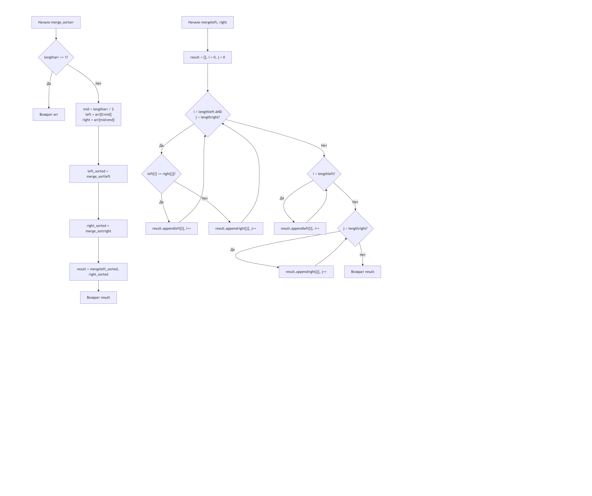
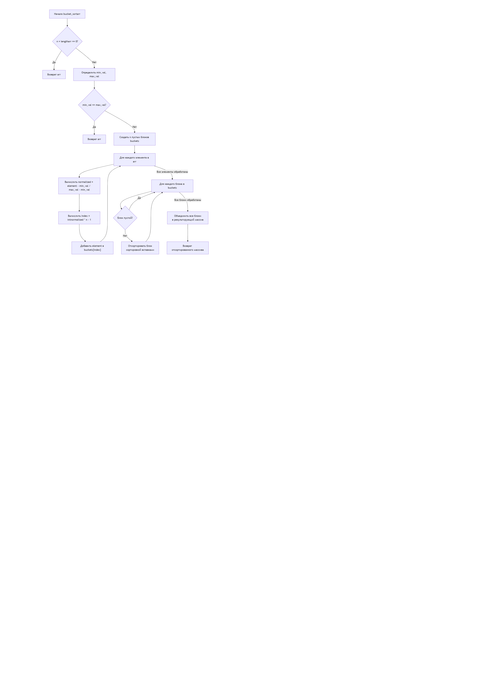
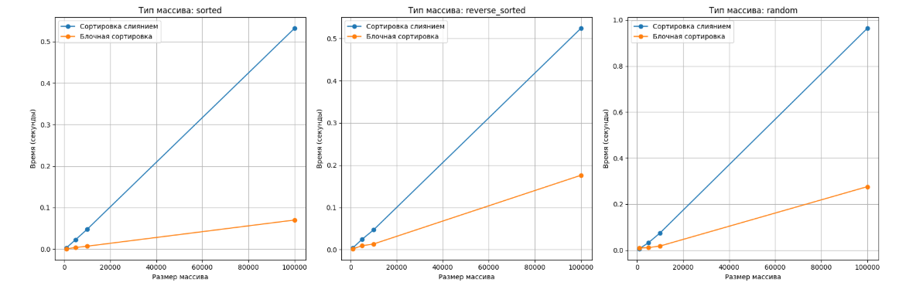

---
jupyter:
  jupytext:
    text_representation:
      extension: .md
      format_name: markdown
      format_version: '1.3'
      jupytext_version: 1.17.3
  kernelspec:
    display_name: Python 3 (ipykernel)
    language: python
    name: python3
---

 # **Алгоритмы сортировки**


## **Цель работы**


изучение основных алгоритмов на сортировки.


Асонов Серей ИУ10-36


## **Задание 1**


### **Классификация алгоритмов сортировки**

#### По принципу работы:
Алгоритмы сравнения: основаны на попарном сравнении элементов

Цифровые алгоритмы: используют внутреннее представление данных

#### По временной сложности:
O(n²) : Пузырьковая, Выбором, Вставками

O(n log n): Слиянием, Быстрая, Пирамидальная

O(n): Блочная, Поразрядная (при определенных условиях)

#### По устойчивости:
Устойчивые: Слиянием, Вставками, Блочная

Неустойчивые: Быстрая, Выбором, Пирамидальная

#### По использованию памяти:
In-place: Быстрая, Пирамидальная, Вставками

Not in-place: Слиянием, Блочная


## **Задание 2**


### **Теоретическое описание алгоритмов**

##### Сортировка слиянием (Merge Sort)
Принцип: Алгоритм стратегии "разделяй и властвуй". Рекурсивно разделяет массив на подмассивы до единичных элементов, затем сливает их в упорядоченные последовательности.

Математическая основа:

Рекуррентное соотношение: T(n) = 2T(n/2) + O(n)

По теореме о рекуррентных соотношениях: T(n) = O(n log n)

#### Блочная сортировка (Bucket Sort)
Принцип: Распределяющий алгоритм, который разбивает входные данные на "ведра" на основе их значений, затем сортирует каждое ведро отдельно.

Условия эффективности:

Равномерное распределение входных данных

Известный диапазон значений

Количество ведер ≈ √n


## **Задание 3**


### **Сортировка слиянием**





### **Блочная сортировка**





## **Задание 4**


### **Сортировка слиянием:**


АЛГОРИТМ СортировкаСлиянием(массив A):
    ВХОД: массив A[0..n-1]
    ВЫХОД: отсортированный массив A
    
    ЕСЛИ n <= 1:
        ВОЗВРАТ A  // базовый случай
    
    // Разделение
    середина = n // 2
    левый_подмассив = A[0..середина-1]
    правый_подмассив = A[середина..n-1]
    
    // Рекурсивная сортировка
    отсортированный_левый = СортировкаСлиянием(левый_подмассив)
    отсортированный_правый = СортировкаСлиянием(правый_подмассив)
    
    // Слияние
    ВОЗВРАТ Слияние(отсортированный_левый, отсортированный_правый)

АЛГОРИТМ Слияние(массив L, массив R):
    ВХОД: два отсортированных массива L и R
    ВЫХОД: объединенный отсортированный массив
    
    результат = новый_массив[длина(L) + длина(R)]
    i = 0, j = 0, k = 0
    
    // Сравниваем и добавляем элементы по порядку
    ПОКА i < длина(L) И j < длина(R):
        ЕСЛИ L[i] <= R[j]:
            результат[k] = L[i]
            i = i + 1
        ИНАЧЕ:
            результат[k] = R[j]
            j = j + 1
        k = k + 1
    
    // Добавляем оставшиеся элементы из L
    ПОКА i < длина(L):
        результат[k] = L[i]
        i = i + 1
        k = k + 1
    
    // Добавляем оставшиеся элементы из R
    ПОКА j < длина(R):
        результат[k] = R[j]
        j = j + 1
        k = k + 1
    
    ВОЗВРАТ результат


### **Блочная сортировка:**


АЛГОРИТМ БлочнаяСортировка(массив A, размер_блока):
    ВХОД: массив A[0..n-1], размер блока
    ВЫХОД: отсортированный массив A
    
    ЕСЛИ длина(A) == 0:
        ВОЗВРАТ A
    
    // Находим диапазон значений
    min_значение = минимальный_элемент(A)
    max_значение = максимальный_элемент(A)
    
    // Создаем блоки
    количество_блоков = (max_значение - min_значение) // размер_блока + 1
    блоки = новый_массив[количество_блоков] из пустых списков
    
    // Распределяем элементы по блокам
    ДЛЯ КАЖДОГО элемента В A:
        индекс_блока = (элемент - min_значение) // размер_блока
        добавить элемент в блоки[индекс_блока]
    
    // Сортируем каждый блок и объединяем
    результат = пустой_массив
    ДЛЯ КАЖДОГО блока В блоки:
        отсортированный_блок = СортировкаВставками(блок)
        добавить отсортированный_блок в результат
    
    ВОЗВРАТ результат

АЛГОРИТМ СортировкаВставками(массив A):
    ВХОД: массив A[0..n-1]
    ВЫХОД: отсортированный массив A
    
    ДЛЯ i ОТ 1 ДО длина(A) - 1:
        ключ = A[i]
        j = i - 1
        
        // Сдвигаем элементы большие ключа
        ПОКА j >= 0 И A[j] > ключ:
            A[j + 1] = A[j]
            j = j - 1
        
        A[j + 1] = ключ
    
    ВОЗВРАТ A


## **Задание 5**


### **Сортировка слиянием:**
#### Достоинства:

Гарантированная временная сложность O(n log n) для любых случаев

Устойчивость - сохраняет порядок равных элементов

Предсказуемое поведение независимо от входных данных

Эффективна для больших объемов данных

Хорошо параллелизуется

#### Недостатки:

Требует O(n) дополнительной памяти

Медленнее in-place алгоритмов на небольших массивах

Рекурсивные вызовы могут вызывать переполнение стека

Константа в O-нотации больше, чем у быстрой сортировки

### **Блочная сортировка:**

#### Достоинства:

Линейная сложность O(n) в среднем случае

Эффективна при равномерном распределении данных

Устойчивость (при правильной реализации)

Хорошо работает с данными с известным диапазоном

#### Недостатки:

Вырождается до O(n²) при плохом распределении

Требует знания о распределении входных данных

Неэффективна для данных с выбросами

Требует дополнительной памяти O(n + k)

Сложность зависит от алгоритма сортировки блоков


## **Задания 6 - 11**

```python
import time
import random
import matplotlib.pyplot as plt
import math

# 1. Сортировка слиянием (Merge Sort)
def merge_sort(arr):
    if len(arr) <= 1:
        return arr
    
    mid = len(arr) // 2
    left = merge_sort(arr[:mid])
    right = merge_sort(arr[mid:])
    
    return merge(left, right)

def merge(left, right):
    result = []
    i = j = 0
    
    while i < len(left) and j < len(right):
        if left[i] <= right[j]:
            result.append(left[i])
            i += 1
        else:
            result.append(right[j])
            j += 1
    
    result.extend(left[i:])
    result.extend(right[j:])
    return result

# 2. Блочная сортировка (Bucket Sort)
def bucket_sort(arr, bucket_size=5):
    if len(arr) == 0:
        return arr
    
    # Находим минимальное и максимальное значения
    min_val = min(arr)
    max_val = max(arr)
    
    # Создаем блоки
    bucket_count = (max_val - min_val) // bucket_size + 1
    buckets = [[] for _ in range(bucket_count)]
    
    # Распределяем элементы по блокам
    for num in arr:
        bucket_index = (num - min_val) // bucket_size
        buckets[bucket_index].append(num)
    
    # Сортируем каждый блок и объединяем
    result = []
    for bucket in buckets:
        # Используем сортировку вставками для сортировки блоков
        result.extend(insertion_sort(bucket))
    
    return result

def insertion_sort(arr):
    for i in range(1, len(arr)):
        key = arr[i]
        j = i - 1
        while j >= 0 and arr[j] > key:
            arr[j + 1] = arr[j]
            j -= 1
        arr[j + 1] = key
    return arr

# Функция для измерения времени выполнения
def measure_sorting_time(sort_func, arr, *args):
    arr_copy = arr.copy()
    start_time = time.time()
    sort_func(arr_copy, *args)
    end_time = time.time()
    return end_time - start_time

# Генерация тестовых данных
def generate_test_arrays(n, array_type):
    if array_type == 'sorted':
        return list(range(n))
    elif array_type == 'reverse_sorted':
        return list(range(n, 0, -1))
    elif array_type == 'random':
        return [random.randint(1, 100000) for _ in range(n)]
    return None

# Основная функция тестирования
def test_sorting_algorithms():
    sizes = [1000, 5000, 10000, 100000]  # n1, n2, n3, n4
    array_types = ['sorted', 'reverse_sorted', 'random']
    algorithms = {
        'Сортировка слиянием': (merge_sort, []),
        'Блочная сортировка': (bucket_sort, [10])  # bucket_size = 10
    }
    
    results = {algo: {arr_type: [] for arr_type in array_types} for algo in algorithms}
    
    for size in sizes:
        print(f"\n--- Тестирование для n = {size} ---")
        
        for arr_type in array_types:
            test_array = generate_test_arrays(size, arr_type)
            print(f"\nТип массива: {arr_type}")
            
            for algo_name, (algo_func, args) in algorithms.items():
                time_taken = measure_sorting_time(algo_func, test_array, *args)
                results[algo_name][arr_type].append(time_taken)
                print(f"{algo_name}: {time_taken:.4f} секунд")
    
    return results, sizes

# Визуализация результатов
def plot_results(results, sizes):
    array_types = ['sorted', 'reverse_sorted', 'random']
    algorithms = list(results.keys())
    
    fig, axes = plt.subplots(1, 3, figsize=(18, 6))
    
    for i, arr_type in enumerate(array_types):
        for algo_name in algorithms:
            times = results[algo_name][arr_type]
            axes[i].plot(sizes, times, marker='o', label=algo_name)
        
        axes[i].set_title(f'Тип массива: {arr_type}')
        axes[i].set_xlabel('Размер массива')
        axes[i].set_ylabel('Время (секунды)')
        axes[i].legend()
        axes[i].grid(True)
    
    plt.tight_layout()
    plt.savefig('sorting_comparison.png')
    plt.show()

# Ручная трассировка для небольших массивов
def manual_trace():
    print("=== РУЧНАЯ ТРАССИРОВКА ===")
    
    # Тестовый массив
    test_array = [64, 34, 25, 12, 22, 11, 90, 5]
    print(f"Исходный массив: {test_array}")
    
    # Сортировка слиянием
    print("\n--- Сортировка слиянием ---")
    sorted_merge = merge_sort(test_array.copy())
    print(f"Результат: {sorted_merge}")
    
    # Блочная сортировка
    print("\n--- Блочная сортировка ---")
    sorted_bucket = bucket_sort(test_array.copy(), 20)
    print(f"Результат: {sorted_bucket}")

# Анализ эффективности
def analyze_efficiency(results, sizes):
    print("\n=== АНАЛИЗ ЭФФЕКТИВНОСТИ ===")
    for size in sizes:
        print(f"\nДля n = {size}:")
        for arr_type in ['sorted', 'reverse_sorted', 'random']:
            merge_time = results['Сортировка слиянием'][arr_type][sizes.index(size)]
            bucket_time = results['Блочная сортировка'][arr_type][sizes.index(size)]
            
            faster = "Слиянием" if merge_time < bucket_time else "Блочная"
            difference = abs(merge_time - bucket_time)
            
            print(f"  {arr_type}: {faster} быстрее на {difference:.4f} сек")

# Запуск тестирования
if __name__ == "__main__":
    # Ручная трассировка
    manual_trace()
    
    # Основное тестирование
    print("\n=== ОСНОВНОЕ ТЕСТИРОВАНИЕ ===")
    results, sizes = test_sorting_algorithms()
    
    # Визуализация результатов
    plot_results(results, sizes)
    
    # Анализ эффективности
    analyze_efficiency(results, sizes)
```




## **Ручная трассировка алгоритмов**


### Сортировка слиянием для массива [64, 34, 25, 12, 22, 11, 90, 5]:

<!-- #raw -->
Разделение:
[64, 34, 25, 12] и [22, 11, 90, 5]
[64, 34] и [25, 12] | [22, 11] и [90, 5]
[64] [34] [25] [12] [22] [11] [90] [5]

Слияние:
[34, 64] + [12, 25] → [12, 25, 34, 64]
[11, 22] + [5, 90] → [5, 11, 22, 90]
[12, 25, 34, 64] + [5, 11, 22, 90] → [5, 11, 12, 22, 25, 34, 64, 90]
<!-- #endraw -->

### Блочная сортировка для массива [64, 34, 25, 12, 22, 11, 90, 5] (bucket_size=20):


Диапазон значений: min=5, max=90
Количество блоков: (90-5)//20 + 1 = 5 блоков

Распределение по блокам:
Блок 0 [5-24]: [12, 22, 11, 5]
Блок 1 [25-44]: [34, 25]
Блок 2 [45-64]: [64]
Блок 3 [65-84]: []
Блок 4 [85-104]: [90]

Сортировка блоков:
Блок 0: [5, 11, 12, 22]
Блок 1: [25, 34]
Блок 2: [64]
Блок 3: []
Блок 4: [90]

Объединение: [5, 11, 12, 22, 25, 34, 64, 90]


## **Анализ эффективности**

<!-- #region jp-MarkdownHeadingCollapsed=true -->
### **Критерии сравнения:**
#### 1.Временная сложность:
##### Сортировка слиянием (Merge Sort):


Лучший случай:   O(n log n)
Средний случай:  O(n log n) 
Худший случай:   O(n log n)
Обоснование:

Алгоритм всегда делит массив пополам: log n уровней рекурсии

На каждом уровне выполняется слияние за O(n)

Итого: O(n) × O(log n) = O(n log n)

##### Блочная сортировка (Bucket Sort):

Лучший случай:   O(n + k)
Средний случай:  O(n + k)
Худший случай:   O(n²)
Обоснование:

Лучший случай: равномерное распределение, все блоки содержат ≈ n/k элементов

Худший случай: все элементы попадают в один блок → вырождается в O(n²)

k - количество блоков

#### 2.Память:

##### Сортировка слиянием:

Требуемая память: O(n)
Распределение памяти:

Дополнительный массив для слияния: O(n)

Стек вызовов рекурсии: O(log n)

Итого: O(n)

##### Блочная сортировка:

Требуемая память: O(n + k)
Распределение памяти:

Массив блоков: O(k)

Элементы в блоках: O(n)

Итого: O(n + k)

#### 3.Устойчивость:

##### Сортировка слиянием:устойчивая

Сохраняет относительный порядок равных элементов

Элементы из левого подмассива добавляются первыми

##### Блочная сортировка : ЗАВИСИТ от алгоритма сортировки блоков
Варианты:

Устойчивая: если использовать устойчивую сортировку блоков (сортировку вставками)

Неустойчивая: если использовать неустойчивую сортировку блоков
<!-- #endregion -->

```python

```
